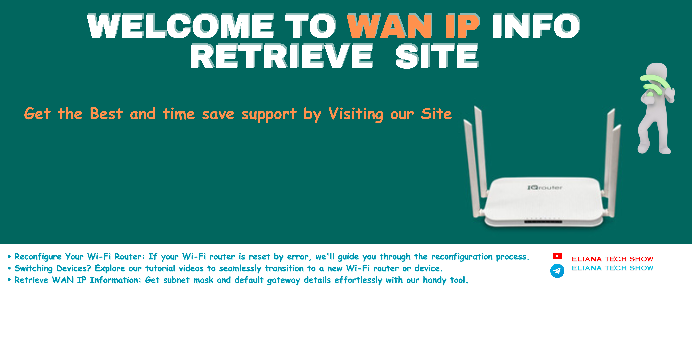
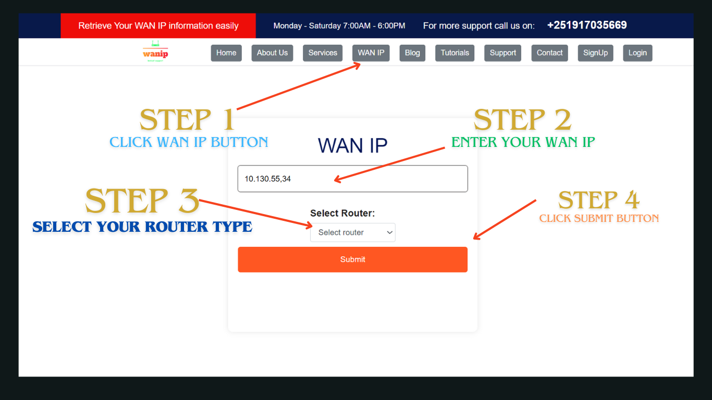

# WAN IP Project README

Welcome to the WAN IP Project README! This project aims to assist users of Ethio Telecom in setting up their Wi-Fi router modems by providing their WAN IP information. Follow this guide to learn about the project's purpose, installation process, usage, and more.

## Deployed Site

-   [WAN IP Project](https://wan-ip-project.vercel.app/)

## Final Project Blog Article

-   [Project Journey](https://docs.google.com/document/d/1bwgjIpss8U4ZwBdmKf0mh-zuXWaqERm2h7oKo_X6208/edit?usp=sharing)

## Authors

-   Yohanes Senbeto
-   Eyob Assefa

## Author's LinkedIn

-   [Yohanes Senbeto](https://www.linkedin.com/in/yohanes-senbeto-61833218a/)

## Installation

To get started with the WAN IP Project, follow these steps:

1. Clone the repository: git clone https://github.com/YohanesSenbeto/WAN-IP-Project.git>
2. Navigate to the project directory: cd WAN-IP-Project
3. Install dependencies for the frontend and backend:
    - For frontend (React.js): cd frontend && npm install
    - For backend (Node.js): cd backend && npm install
4. Set up the database using XAMPP or another suitable database management system.
5. Configure the backend to connect to your database by updating the database configuration file.
6. Run the frontend and backend servers:
    - For frontend: cd frontend && npm start
    - For backend: cd backend && node app.js

## Usage

Once the project is set up and running, users can visit the deployed site to access the WAN IP information for their Wi-Fi router modems. They can enter their router model and view the corresponding WAN IP address.

## Contributing

We welcome contributions from the community to enhance the WAN IP Project. If you have any ideas for improvements, bug fixes, or new features, please feel free to open an issue or submit a pull request on GitHub.

## Related Projects

Check out these related projects for further exploration:

-   Eliana Tech Show[https://t.ly/lZEQx]: YouTube channel providing tutorials on technology and networking.

## Licensing

The WAN IP Project is licensed under the MIT License.

## Screenshots

-   [A couple of resources](#)
-   [What your code repository says about you](#)
-   [Awesome READMEs](#)

Thank you for exploring the WAN IP Project! Feel free to connect with us on LinkedIn and share your thoughts. Let's continue this journey together.

## Getting Started with Create React App

This project was bootstrapped with [Create React App](https://github.com/facebook/create-react-app).

### Available Scripts

In the project directory, you can run:

-   npm start : Runs the app in the development mode. Open [http://localhost:3000](http://localhost:3000)to view it in your browser.

-   npm test : Launches the test runner in the interactive watch mode. See the section about [running tests](https://facebook.github.io/create-react-app/docs/running-tests) for more information.

-   npm run build : Builds the app for production to the build folder. It correctly bundles React in production mode and optimizes the build for the best performance.

-   npm run eject : **Note: this is a one-way operation. Once you eject , you can't go back!**

Learn more in the [Create React App documentation](https://facebook.github.io/create-react-app/docs/getting-started) and explore the [React documentation](https://reactjs.org/).

# Getting Started with Create React App

This project was bootstrapped with [Create React App](https://github.com/facebook/create-react-app).

## Available Scripts

In the project directory, you can run:

### `npm start`

Runs the app in the development mode.\
Open [http://localhost:3000](http://localhost:3000)to view it in your browser.
The page will reload when you make changes.\
You may also see any lint errors in the console.

### `npm test`

Launches the test runner in the interactive watch mode.\
See the section about [running tests](https://facebook.github.io/create-react-app/docs/running-tests) for more information.

### `npm run build`

Builds the app for production to the `build` folder.\
It correctly bundles React in production mode and optimizes the build for the best performance.
The build is minified and the filenames include the hashes.\
Your app is ready to be deployed!
See the section about [deployment](https://facebook.github.io/create-react-app/docs/deployment) for more information.

### `npm run eject`

**Note: this is a one-way operation. Once you `eject`, you can't go back!**
If you aren't satisfied with the build tool and configuration choices, you can `eject` at any time. This command will remove the single build dependency from your project.
Instead, it will copy all the configuration files and the transitive dependencies (webpack, Babel, ESLint, etc) right into your  
project so you have full control over them. All of the commands except `eject` will still work, but they will point to the copied scripts so you can tweak them. At this point you're on your own.
You don't have to ever use `eject`. The curated feature set is suitable for small and middle deployments, and you shouldn't feel obligated to use this feature. However we understand that this tool wouldn't be useful if you couldn't customize it when you are ready for it.

## Learn More

You can learn more in the [Create React App documentation](https://facebook.github.io/create-react-app/docs/getting-started).  
To learn React, check out the [React documentation](https://reactjs.org/).

### Code Splitting

This section has moved here: [https://facebook.github.io/create-react-app/docs/code-splitting](https://facebook.github.io/create-react-app/docs/code-splitting)

### Analyzing the Bundle Size

This section has moved here: [https://facebook.github.io/create-react-app/docs/analyzing-the-bundle-size](https://facebook.github.io/create-react-app/docs/analyzing-the-bundle-size)

### Making a Progressive Web App

This section has moved here: [https://facebook.github.io/create-react-app/docs/making-a-progressive-web-app](https://facebook.github.io/create-react-app/docs/making-a-progressive-web-app)

### Advanced Configuration

This section has moved here: [https://facebook.github.io/create-react-app/docs/advanced-configuration](https://facebook.github.io/create-react-app/docs/advanced-configuration)

### Deployment

This section has moved here: [https://facebook.github.io/create-react-app/docs/deployment](https://facebook.github.io/create-react-app/docs/deployment)

### `npm run build` fails to minify

This section has moved here: [https://facebook.github.io/create-react-app/docs/troubleshooting#npm-run-build-fails-to-minify](https://facebook.github.io/create-react-app/docs/troubleshooting#npm-run-build-fails-to-minify)
#Introduction
Welcome to the WAN IP Project README! Our project aims to assist users of Ethio Telecom in setting up their Wi-Fi router modems by providing their WAN IP information. This README will guide you through the project's purpose, installation process, usage, and more.
#Deployed Site: WAN IP Project
#Final Project Blog Article: Project Journey
#Authors: Yohanes Senbeto, Eyob Assefa
#Author's LinkedIn: Yohanes Senbeto
Installation
#To get started with the WAN IP Project, follow these steps:
#Clone the repository: git clone https://github.com/YohanesSenbeto/WAN-IP-Project.git
#Navigate to the project directory: cd WAN-IP-Project
#Install dependencies for the frontend and backend:
#For frontend (React.js): cd frontend && npm install
#For backend (Node.js): cd backend && npm install
#Set up the database using XAMPP or another suitable database management system.
#Configure the backend to connect to your database by updating the database configuration file.
#Run the frontend and backend servers:
#For frontend: cd frontend && npm start
#For backend: cd backend && node app.js
#Usage
Once the project is set up and running, users can visit the deployed site to access the WAN IP information for their Wi-Fi router modems. They can enter their router model and view the corresponding WAN IP address.
#Contributing
We welcome contributions from the community to enhance the WAN IP Project. If you have any ideas for improvements, bug fixes, or new features, please feel free to open an issue or submit a pull request on GitHub.
Related Projects
Check out these related projects for further exploration:
Eliana Tech Show: YouTube channel providing tutorials on technology and networking.
#Licensing
The WAN IP Project is licensed under the MIT License.
#Screenshots
#A couple of resources:
What your code repository says about you
Awesome READMEs
Thank you for exploring the WAN IP Project! Feel free to connect with us on LinkedIn and share your thoughts. Let's continue this journey together.

# Getting Started with Create React App

This project was bootstrapped with [Create React App](https://github.com/facebook/create-react-app).

## Available Scripts

In the project directory, you can run:

### `npm start`

Runs the app in the development mode.\
Open [http://localhost:3000](http://localhost:3000)to view it in your browser.
The page will reload when you make changes.\
You may also see any lint errors in the console.

### `npm test`

Launches the test runner in the interactive watch mode.\
See the section about [running tests](https://facebook.github.io/create-react-app/docs/running-tests) for more information.

### `npm run build`

Builds the app for production to the `build` folder.\
It correctly bundles React in production mode and optimizes the build for the best performance.
The build is minified and the filenames include the hashes.\
Your app is ready to be deployed!
See the section about [deployment](https://facebook.github.io/create-react-app/docs/deployment) for more information.

### `npm run eject`

**Note: this is a one-way operation. Once you `eject`, you can't go back!**
If you aren't satisfied with the build tool and configuration choices, you can `eject` at any time. This command will remove the single build dependency from your project.
Instead, it will copy all the configuration files and the transitive dependencies (webpack, Babel, ESLint, etc) right into your  
project so you have full control over them. All of the commands except `eject` will still work, but they will point to the copied scripts so you can tweak them. At this point you're on your own.
You don't have to ever use `eject`. The curated feature set is suitable for small and middle deployments, and you shouldn't feel obligated to use this feature. However we understand that this tool wouldn't be useful if you couldn't customize it when you are ready for it.

## Learn More

You can learn more in the [Create React App documentation](https://facebook.github.io/create-react-app/docs/getting-started).  
To learn React, check out the [React documentation](https://reactjs.org/).

### Code Splitting

This section has moved here: [https://facebook.github.io/create-react-app/docs/code-splitting](https://facebook.github.io/create-react-app/docs/code-splitting)

### Analyzing the Bundle Size

This section has moved here: [https://facebook.github.io/create-react-app/docs/analyzing-the-bundle-size](https://facebook.github.io/create-react-app/docs/analyzing-the-bundle-size)

### Making a Progressive Web App

This section has moved here: [https://facebook.github.io/create-react-app/docs/making-a-progressive-web-app](https://facebook.github.io/create-react-app/docs/making-a-progressive-web-app)

### Advanced Configuration

This section has moved here: [https://facebook.github.io/create-react-app/docs/advanced-configuration](https://facebook.github.io/create-react-app/docs/advanced-configuration)

### Deployment

This section has moved here: [https://facebook.github.io/create-react-app/docs/deployment](https://facebook.github.io/create-react-app/docs/deployment)

### `npm run build` fails to minify

This section has moved here: [https://facebook.github.io/create-react-app/docs/troubleshooting#npm-run-build-fails-to-minify](https://facebook.github.io/create-react-app/docs/troubleshooting#npm-run-build-fails-to-minify)
#Introduction
Welcome to the WAN IP Project README! Our project aims to assist users of Ethio Telecom in setting up their Wi-Fi router modems by providing their WAN IP information. This README will guide you through the project's purpose, installation process, usage, and more.
#Deployed Site: WAN IP Project
#Final Project Blog Article: Project Journey
#Authors: Yohanes Senbeto, Eyob Assefa
#Author's LinkedIn: Yohanes Senbeto
Installation
#To get started with the WAN IP Project, follow these steps:
#Clone the repository: git clone https://github.com/YohanesSenbeto/WAN-IP-Project.git
#Navigate to the project directory: cd WAN-IP-Project
#Install dependencies for the frontend and backend:
#For frontend (React.js): cd frontend && npm install
#For backend (Node.js): cd backend && npm install
#Set up the database using XAMPP or another suitable database management system.
#Configure the backend to connect to your database by updating the database configuration file.
#Run the frontend and backend servers:
#For frontend: cd frontend && npm start
#For backend: cd backend && node app.js
#Usage
Once the project is set up and running, users can visit the deployed site to access the WAN IP information for their Wi-Fi router modems. They can enter their router model and view the corresponding WAN IP address.
#Contributing
We welcome contributions from the community to enhance the WAN IP Project. If you have any ideas for improvements, bug fixes, or new features, please feel free to open an issue or submit a pull request on GitHub.
Related Projects
Check out these related projects for further exploration:
Eliana Tech Show: YouTube channel providing tutorials on technology and networking.
#Licensing
The WAN IP Project is licensed under the MIT License.
#Screenshots
#A couple of resources:
What your code repository says about you
Awesome READMEs
Thank you for exploring the WAN IP Project! Feel free to connect with us on LinkedIn and share your thoughts. Let's continue this journey together.

# Getting Started with Create React App

This project was bootstrapped with [Create React App](https://github.com/facebook/create-react-app).

## Available Scripts

In the project directory, you can run:

### `npm start`

Runs the app in the development mode.\
Open [http://localhost:3000](http://localhost:3000)to view it in your browser.
The page will reload when you make changes.\
You may also see any lint errors in the console.

### `npm test`

Launches the test runner in the interactive watch mode.\
See the section about [running tests](https://facebook.github.io/create-react-app/docs/running-tests) for more information.

### `npm run build`

Builds the app for production to the `build` folder.\
It correctly bundles React in production mode and optimizes the build for the best performance.
The build is minified and the filenames include the hashes.\
Your app is ready to be deployed!
See the section about [deployment](https://facebook.github.io/create-react-app/docs/deployment) for more information.

### `npm run eject`

**Note: this is a one-way operation. Once you `eject`, you can't go back!**
If you aren't satisfied with the build tool and configuration choices, you can `eject` at any time. This command will remove the single build dependency from your project.
Instead, it will copy all the configuration files and the transitive dependencies (webpack, Babel, ESLint, etc) right into your  
project so you have full control over them. All of the commands except `eject` will still work, but they will point to the copied scripts so you can tweak them. At this point you're on your own.
You don't have to ever use `eject`. The curated feature set is suitable for small and middle deployments, and you shouldn't feel obligated to use this feature. However we understand that this tool wouldn't be useful if you couldn't customize it when you are ready for it.

## Learn More

You can learn more in the [Create React App documentation](https://facebook.github.io/create-react-app/docs/getting-started).  
To learn React, check out the [React documentation](https://reactjs.org/).

### Code Splitting

This section has moved here: [https://facebook.github.io/create-react-app/docs/code-splitting](https://facebook.github.io/create-react-app/docs/code-splitting)

### Analyzing the Bundle Size

This section has moved here: [https://facebook.github.io/create-react-app/docs/analyzing-the-bundle-size](https://facebook.github.io/create-react-app/docs/analyzing-the-bundle-size)

### Making a Progressive Web App

This section has moved here: [https://facebook.github.io/create-react-app/docs/making-a-progressive-web-app](https://facebook.github.io/create-react-app/docs/making-a-progressive-web-app)

### Advanced Configuration

This section has moved here: [https://facebook.github.io/create-react-app/docs/advanced-configuration](https://facebook.github.io/create-react-app/docs/advanced-configuration)

### Deployment

This section has moved here: [https://facebook.github.io/create-react-app/docs/deployment](https://facebook.github.io/create-react-app/docs/deployment)

### `npm run build` fails to minify

This section has moved here: [https://facebook.github.io/create-react-app/docs/troubleshooting#npm-run-build-fails-to-minify](https://facebook.github.io/create-react-app/docs/troubleshooting#npm-run-build-fails-to-minify)
make amazing readme file
Answer :

Share icon
It looks like you have provided a detailed README file for the WAN IP Project, which includes information about the project's purpose, installation process, usage, contributing guidelines, related projects, licensing, and more. Here are some suggestions to enhance your README file:

1. **Table of Contents**: Consider adding a table of contents with links to different sections for easier navigation.

2. **Project Description**: Provide a brief overview of the project, its goals, and how it can benefit users.

3. **Installation Instructions**: You already have detailed installation steps, but you can also include any specific requirements or dependencies users need to have before setting up the project.

4. **Usage**: Expand on how users can interact with the deployed site and any specific functionalities they can utilize.

5. **Contributing Guidelines**: Include specific instructions on how users can contribute to the project, such as code formatting guidelines, branch naming conventions, and pull request procedures.

6. **Screenshots**: Add visual representations of the project, such as screenshots of the deployed site or key features.

7. **License Information**: Provide a clear explanation of the project's licensing terms and how users can use and distribute the code.

8. **Contact Information**: Consider adding a section where users can reach out to the authors for questions, feedback, or collaboration opportunities.

By incorporating these suggestions, you can create an even more informative and engaging README file for your project. Good luck with your WAN IP Project!
Question :

use this one
#Introduction
Welcome to the WAN IP Project README! Our project aims to assist users of Ethio Telecom in setting up their Wi-Fi router modems by providing their WAN IP information. This README will guide you through the project's purpose, installation process, usage, and more.
#Deployed Site: WAN IP Project
#Final Project Blog Article: Project Journey
#Authors: Yohanes Senbeto, Eyob Assefa
#Author's LinkedIn: Yohanes Senbeto
Installation
#To get started with the WAN IP Project, follow these steps:
#Clone the repository: git clone https://github.com/YohanesSenbeto/WAN-IP-Project.git
#Navigate to the project directory: cd WAN-IP-Project
#Install dependencies for the frontend and backend:
#For frontend (React.js): cd frontend && npm install
#For backend (Node.js): cd backend && npm install
#Set up the database using XAMPP or another suitable database management system.
#Configure the backend to connect to your database by updating the database configuration file.
#Run the frontend and backend servers:
#For frontend: cd frontend && npm start
#For backend: cd backend && node app.js
#Usage
Once the project is set up and running, users can visit the deployed site to access the WAN IP information for their Wi-Fi router modems. They can enter their router model and view the corresponding WAN IP address.
#Contributing
We welcome contributions from the community to enhance the WAN IP Project. If you have any ideas for improvements, bug fixes, or new features, please feel free to open an issue or submit a pull request on GitHub.
Related Projects
Check out these related projects for further exploration:
Eliana Tech Show: YouTube channel providing tutorials on technology and networking.
#Licensing
The WAN IP Project is licensed under the MIT License.
#Screenshots
#A couple of resources:
What your code repository says about you
Awesome READMEs
Thank you for exploring the WAN IP Project! Feel free to connect with us on LinkedIn and share your thoughts. Let's continue this journey together.

# Getting Started with Create React App

This project was bootstrapped with [Create React App](https://github.com/facebook/create-react-app).

## Available Scripts

In the project directory, you can run:

### `npm start`

Runs the app in the development mode.\
Open [http://localhost:3000](http://localhost:3000)to view it in your browser.
The page will reload when you make changes.\
You may also see any lint errors in the console.

### `npm test`

Launches the test runner in the interactive watch mode.\
See the section about [running tests](https://facebook.github.io/create-react-app/docs/running-tests) for more information.

### `npm run build`

Builds the app for production to the `build` folder.\
It correctly bundles React in production mode and optimizes the build for the best performance.
The build is minified and the filenames include the hashes.\
Your app is ready to be deployed!
See the section about [deployment](https://facebook.github.io/create-react-app/docs/deployment) for more information.

### `npm run eject`

**Note: this is a one-way operation. Once you `eject`, you can't go back!**
If you aren't satisfied with the build tool and configuration choices, you can `eject` at any time. This command will remove the single build dependency from your project.
Instead, it will copy all the configuration files and the transitive dependencies (webpack, Babel, ESLint, etc) right into your  
project so you have full control over them. All of the commands except `eject` will still work, but they will point to the copied scripts so you can tweak them. At this point you're on your own.
You don't have to ever use `eject`. The curated feature set is suitable for small and middle deployments, and you shouldn't feel obligated to use this feature. However we understand that this tool wouldn't be useful if you couldn't customize it when you are ready for it.

## Learn More

You can learn more in the [Create React App documentation](https://facebook.github.io/create-react-app/docs/getting-started).  
To learn React, check out the [React documentation](https://reactjs.org/).

### Code Splitting

This section has moved here: [https://facebook.github.io/create-react-app/docs/code-splitting](https://facebook.github.io/create-react-app/docs/code-splitting)

### Analyzing the Bundle Size

This section has moved here: [https://facebook.github.io/create-react-app/docs/analyzing-the-bundle-size](https://facebook.github.io/create-react-app/docs/analyzing-the-bundle-size)

### Making a Progressive Web App

This section has moved here: [https://facebook.github.io/create-react-app/docs/making-a-progressive-web-app](https://facebook.github.io/create-react-app/docs/making-a-progressive-web-app)

### Advanced Configuration

This section has moved here: [https://facebook.github.io/create-react-app/docs/advanced-configuration](https://facebook.github.io/create-react-app/docs/advanced-configuration)

### Deployment

This section has moved here: [https://facebook.github.io/create-react-app/docs/deployment](https://facebook.github.io/create-react-app/docs/deployment)

### `npm run build` fails to minify

This section has moved here: [https://facebook.github.io/create-react-app/docs/troubleshooting#npm-run-build-fails-to-minify](https://facebook.github.io/create-react-app/docs/troubleshooting#npm-run-build-fails-to-minify)
